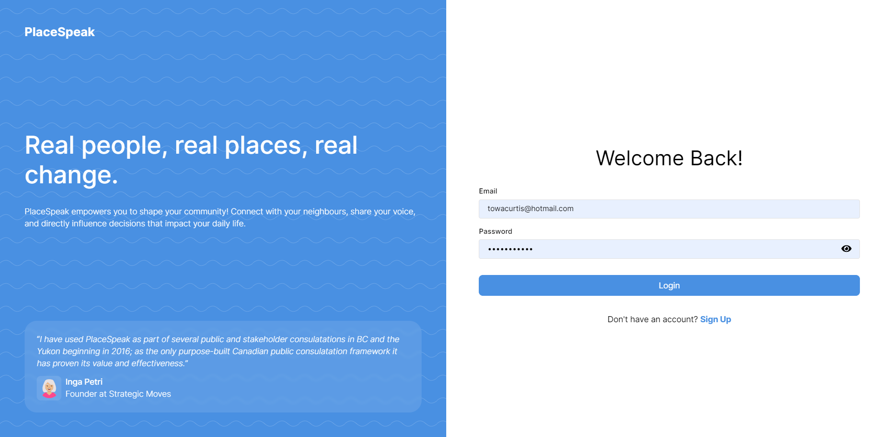
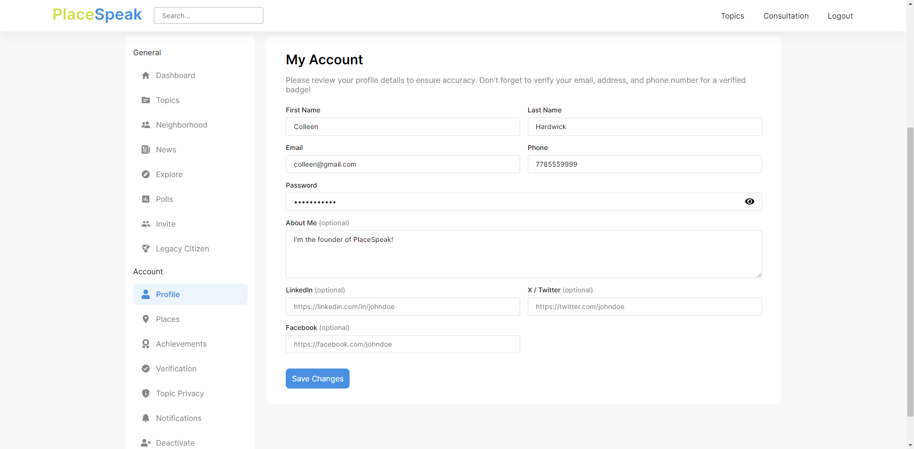
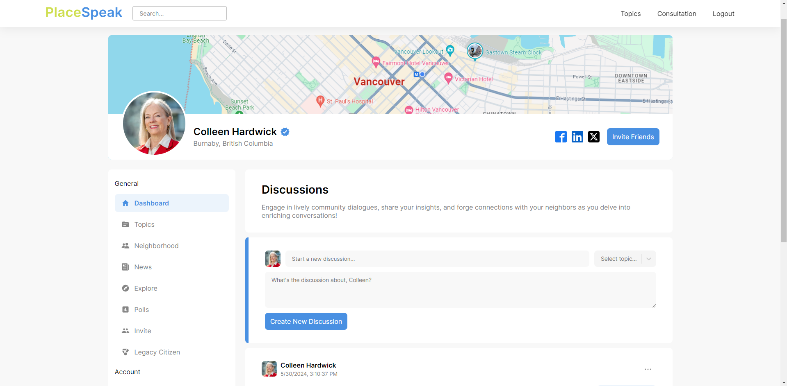
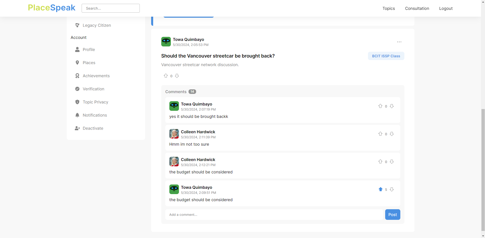
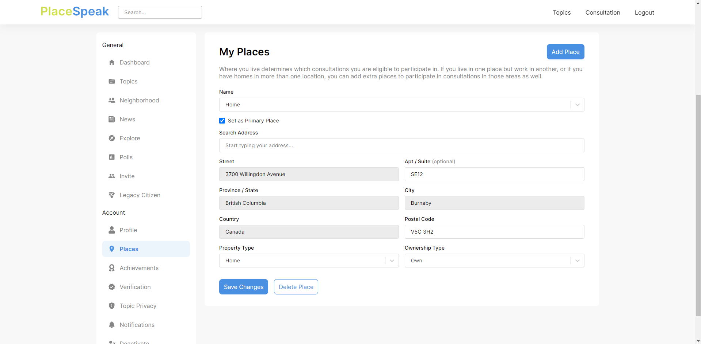
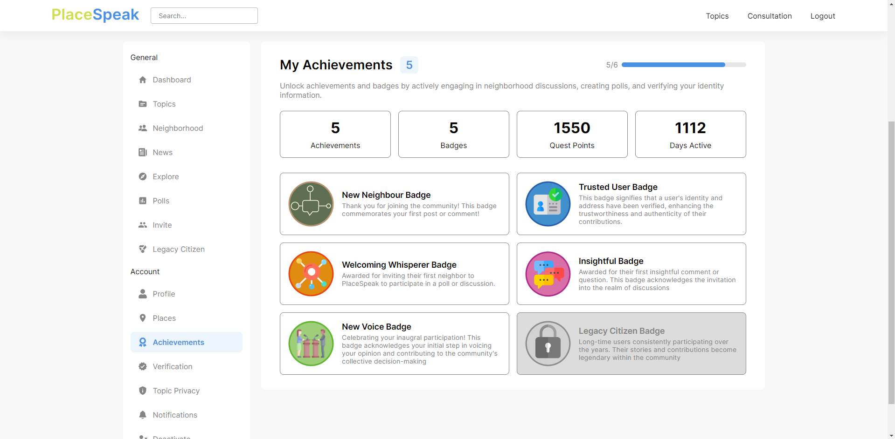

# PlaceSpeak

PlaceSpeak is a location-based civic engagement platform designed to consult with people within specific geographic boundaries. It empowers residents to make a meaningful impact on the communities where they live, work, and play. Users can connect with their neighborhoods online through proof of residency, participate in discussions, and contribute to local decisions. Our team added a gamification layer to enhance user engagement and reduce churn.

_Check out the live project [_here_](https://placespeak.towaquimbayo.com/)._

## Table of Contents

* [Screenshots](#screenshots)
* [Acknowledgements](#acknowledgements)
* [Technologies](#technologies)
* [Features](#features)
  * [User Authentication and Management](#user-authentication-and-management)
  * [Gamification System](#gamification-system)
  * [Places Management](#places-management)
  * [Community Discussions](#community-discussions)

## Screenshots

|  |  |
|:--:|:--:|
| _Login Page_ | _Profile Page_ |
|  |  |
| _Dashboard Page_ | _Discussion Post & Comments Page_ |
|  |  |
| _Places Page_ | _Achievements Page_ |

## Acknowledgements

* Towa Quimbayo [GitHub](https://github.com/towaquimbayo) [LinkedIn](https://www.linkedin.com/in/towa-quimbayo/)
* Juan Escalada [GitHub](https://github.com/jescalada) [LinkedIn](https://www.linkedin.com/in/jescalada/)
* Abhishek Chouhan [GitHub](https://github.com/abhishekchouhannk) [LinkedIn](https://www.linkedin.com/in/abhishekchouhannk)
* Noufil Saqib [GitHub](https://github.com/noufilsaqib) [LinkedIn](https://www.linkedin.com/in/muhammad-noufil-saqib/)

## Technologies

* React.js `v18.3.1`
* CSS3
* React Confetti Explosion `v2.1.2`
* React Helmet `v6.1.0`
* React Modal `v3.16.1`
* React Redux `v9.1.2`
* React Select `v5.8.0`
* Redux `v5.0.1`
* Redux-Thunk `v3.1.0`
* Mapbox `v1.0.0-beta.21`
* Python
* Django `v5.0.6`
* Django Cors-Headers `v4.3.1`
* Django REST-Framework `v3.15.1`
* PyJWT `v2.8.0`
* SQLAlchemy `v2.0.28`
* Vercel

## Features

### User Authentication and Management

Ensuring secure access and comprehensive management of user accounts to protect user data and provide seamless user experiences.

* __Secure Authentication__: Simple email and password-based authentication provides secure access to the platform, protecting user data and ensuring privacy.
* __Login/Signup__: A straightforward process for users to create new accounts or log in to existing ones, facilitating easy access to the platform.
* __Account Management__: Users can view and edit their personal information, including name, email, password, phone number, and social media accounts, enabling them to keep their profiles up to date.

### Gamification System

Incentivizing user engagement and participation through a comprehensive gamification system that rewards users for their activities.

* __Badge Releases and Achievement Unlocks__: Users earn badges for various activities, such as verifying profiles, participating in polls, and engaging in community interactions. This system encourages users to be more active and involved.
  * __New Neighbour Badge__: Awarded after making their first post or comment.
  * __Trusted User Badge__: Awarded after verifying their phone, address(es), and email address.
  * __New Voice Badge__: Awarded after participating in their first poll or creating a new poll.
  * __Insightful Badge__: Awarded after making a comment with over 80% approval rating and a minimum of over 5 upvotes.
  * __Welcoming Whisperer Badge__: Awarded after inviting a user who successfully completes their first activity.
  * __Legacy Citizen Badge__: Awarded after using the platform regularly for a year.
* __Badge Management__: Robust backend logic to manage badge releases for activities such as verification, polls, and user interactions, ensuring a smooth and efficient gamification process.
* __Points-Rewarding System__: Users accumulate quest points for engaging with the platform, enhancing long-term engagement by providing immediate rewards and goals.
* __Achievements Display__: An intuitive interface allows users to view their earbed badges, achievements, quest points, and number of active days on the platform, fostering a sense of accomplishment and ongoing participation through immediate visual feedback.
* __Provisional Schema__: Implemented new Badges and User Badges tables to support gamification features, ensuring seamless integration and future scalability. This backend enhancement is crucial for maintaining a robust and scalable system.

### Places Management

Managing and validating user-defined geographic boundaries to ensure accurate and relevant community engagement.

* __Add, Remove, and Edit Places__: Users can manage their places, which is crucial for defining neighborhood boundaries and ensuring accurate participation in local discussions.
* __Primary Place__: Users can designate a primary place that affects the threads and discussions visible to them, ensuring they are engaged with relevant local content.
* __Address Validation and Autofill__: Using Mapbox APIs tools, addresses are automatically validated and converted into geo coordinates. Users receive suggestions while typing their address, ensuring accurate and validated fields without manual checks. This feature is critical for ensuring that consultations include all valid users in an area.

### Community Discussions

Facilitating community engagement through interactive discussion features that allow users to connect and share their views.

* __Dashboard System__: Users can view a thread of discussion posts around their neighborhood, upvote, downvote, and create new posts or comments. This interactive system encourages community participation and dialogue.
* __Mini User Profile__: Users can hover over the user profile icons to view other users' information, such as their unlocked badges and social media accounts (Facebook, Twitter, LinkedIn), fostering a sense of community and connection.
